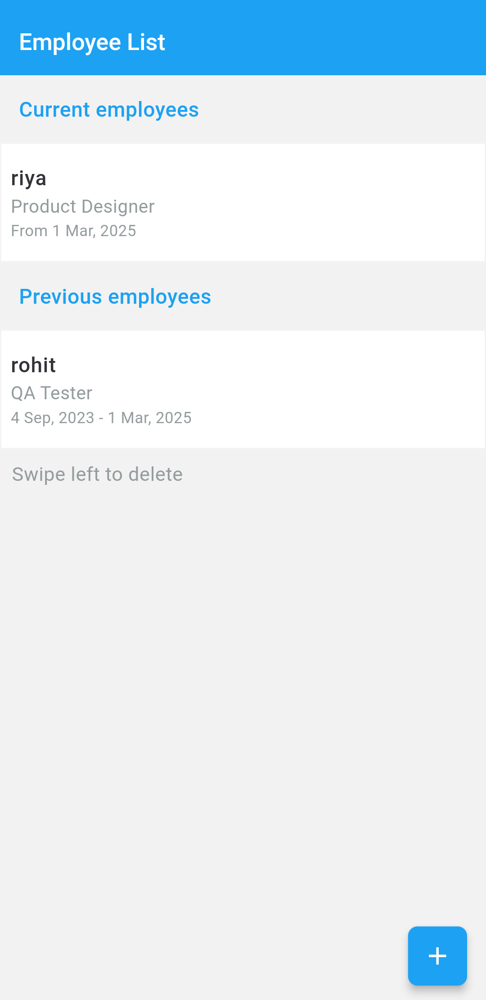
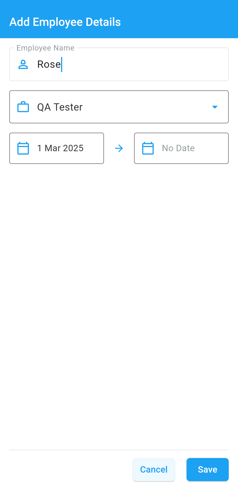
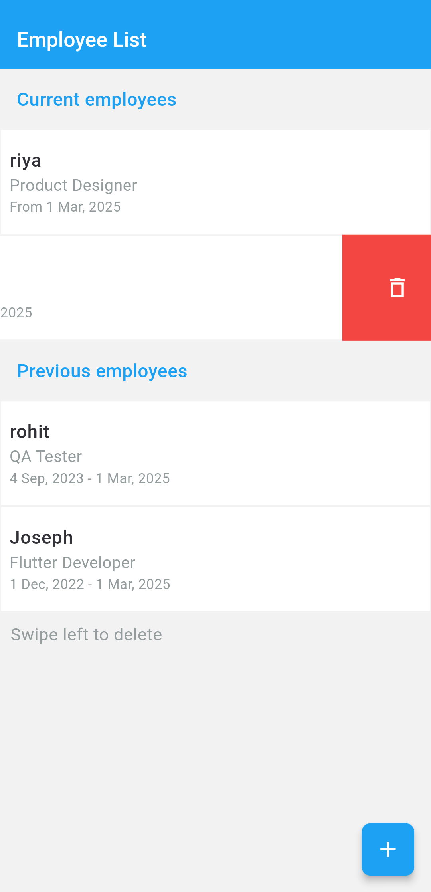
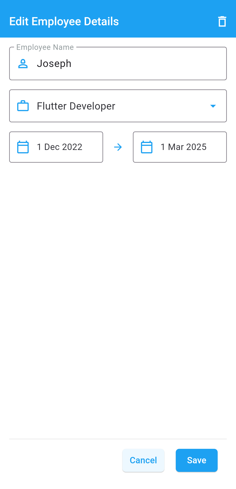
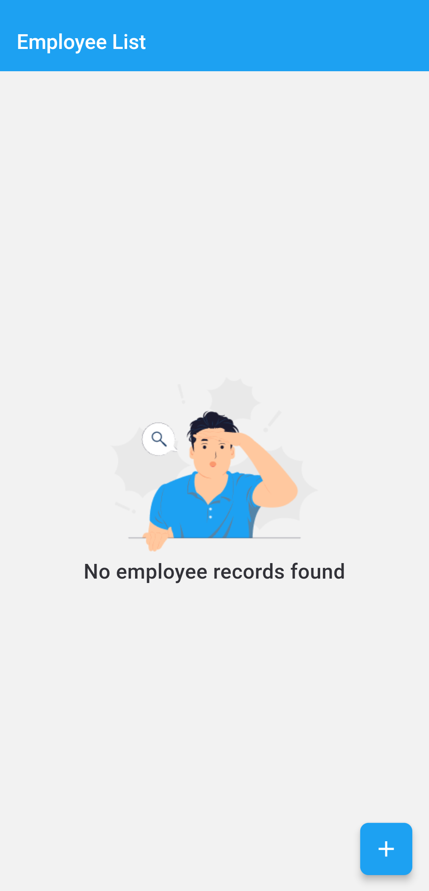

# Employee_Records

## Overview
This is a Flutter application developed as part of an assignment. The app includes various UI elements and handles multiple edge cases efficiently. The app is based on crud operation. It is available as an APK, a working web version, and a demonstration video.

## Features
- **Cross-platform**: Runs on Android and Web
- **State Management**: Utilizes Bloc
- **Offline Support**: Uses local storage (Sqlite)

## Screenshots

### EmployeeList Screen


### AddEmployeeDetail Screen


### EmployeeList Screen


### EditEmployeeDetail Screen


### EmployeeList Screen


## Project Structure
```
├── lib
│   ├── main.dart  # Entry point of the application
│   ├── modules/    # Feature-based modules
│   ├── core/       # database services
│   ├── utils/      # Helper functions and constants
│   ├── widgets/    # Reusable UI components
├── assets/         # Images, fonts, etc.
├── pubspec.yaml    # Dependencies and assets configuration
```

## Installation
To run this app locally, follow these steps:

1. Clone the repository:
   ```sh
   git clone https://github.com/your-username/Employee_Records.git
   cd Employee_Records.git
   ```
2. Install dependencies:
   
   flutter pub get
   
3. Run the app:
   
   flutter run
   

## Contributing
Contributions are welcome! Please create a pull request if you have improvements.

## License
This project is licensed under the MIT License - see the [LICENSE](LICENSE) file for details.

